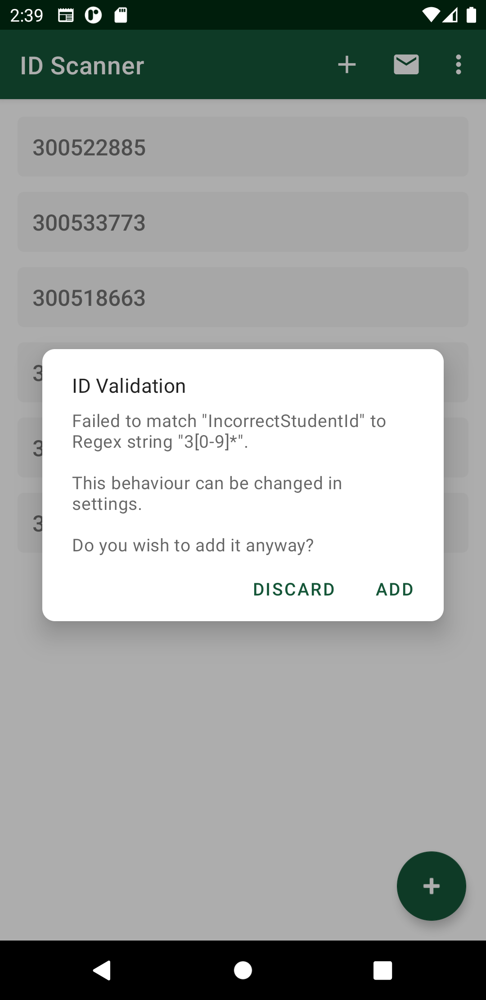

# IDScanner
## COMP103 ID Scanner by Isaac Young and Nathanael Rais

  
  
  
  
  
 

# Features 
- Add Student IDs from QR Code
- Add Student IDs manually
- Edit/Delete Student IDs
- Default email address
- Default email subject (Use keyword "$date" to insert the date and time)
- Regex matching for checking validity of QR codes

